# MaquetteNews Blog for modelers

I took the advice of my mentor and the teachers of the Code Institute's Diploma in Software Development Course and I have created a blog site which I liked and enjoyed the development of it. This blog page was inspired mainly by Code Institute: 'I think, therefore I blog' lessons.

For link to this website click [Here](https://maquettenews.herokuapp.com/).

Design has been focused to *Desktop, Laptop and Tablet first* and *Responsive* but it is also working on mobile assets.

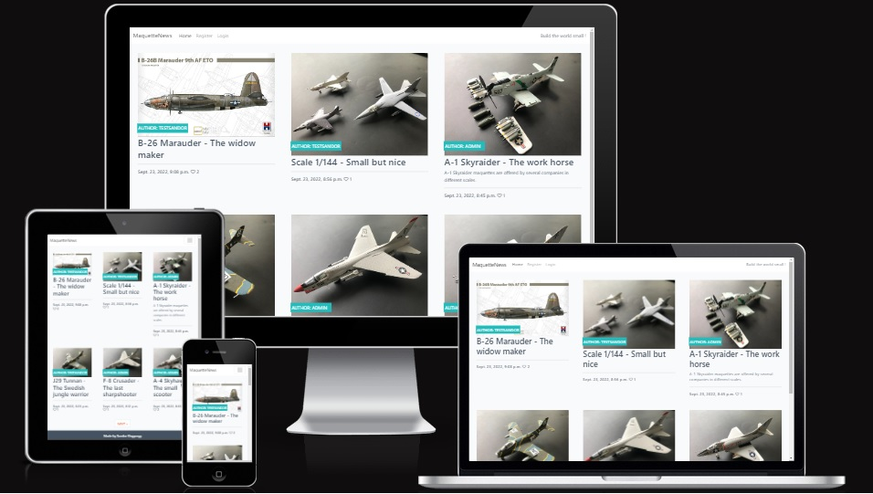

## Who is this blog site for?

This blog pages contains information about maquettes which are mainly aircrafts. These information would be interesting who makes maquette or who wants a little bit more info about a specific model.

## What does this website do?

The website serves as a collection of pictures and short descriptions of different maquettes. The registered users could take posts, like or comment any posts. Possibility of comment could provide a base for small conversation between users. The non-registered users can see the posts but they can not take a post, like or comment the posts.

## UX 5 Planes

### Strategy Plane

The pages were created in a simple way. The information, pictures are clear and serve to help the visitors of the website. The posts are following the same structure and containing the same 'like' and 'comments' icons. There are sort excerpts under the title of the posts. The comments built on a simple way and contain the name of the user, the date of commenting and finally the content of the comments. I created 'Delete' and 'Update' buttons under every comments.

### Scope Plane

In this project you can find the following features:
* The header and footer are common in every pages (before login and after it)
* Two different pages which are as follows:

- Home page contains three posts and pictures and the possibilities of register or login. The step of visitor is depend that she/he/they visits the blog as registered user or not.

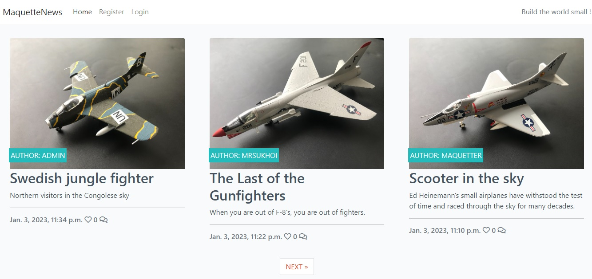

- Home page header changes after login and the possibility of register will disappear.

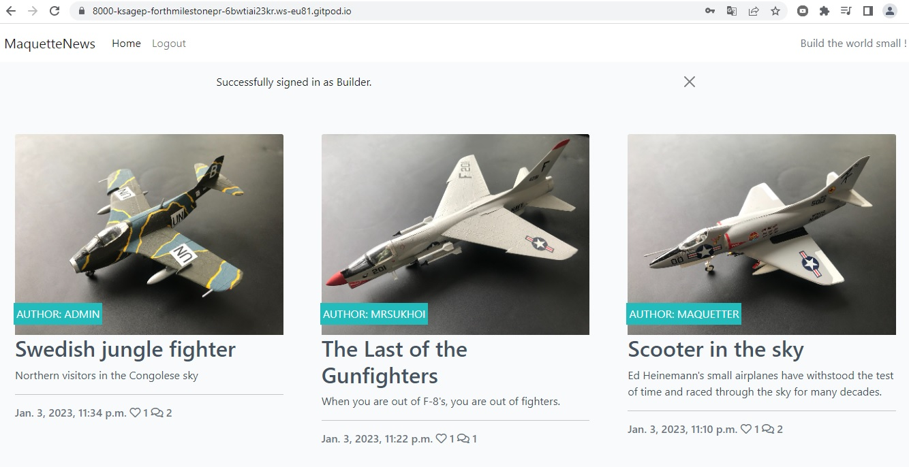

- The post view contains a pictures of maquette or a box art as well as a short description of the kit. 

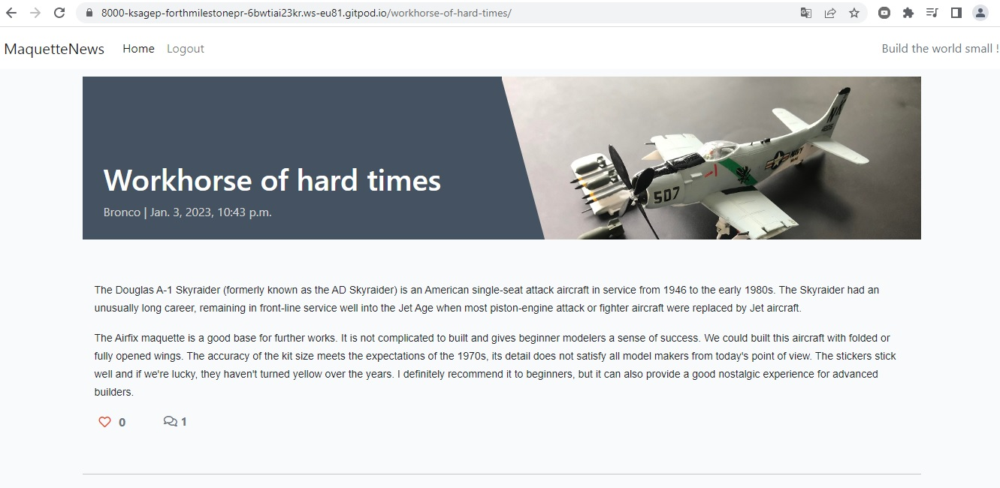

Under this part the registered users could like the post or comment it. I created a small warning message that the user cannot submit the empty comment form. Under the approved and posted comment there are two buttons: Delete and Update. These buttons provide possibilities for user, who commented the post, delete the own post or edit this. 

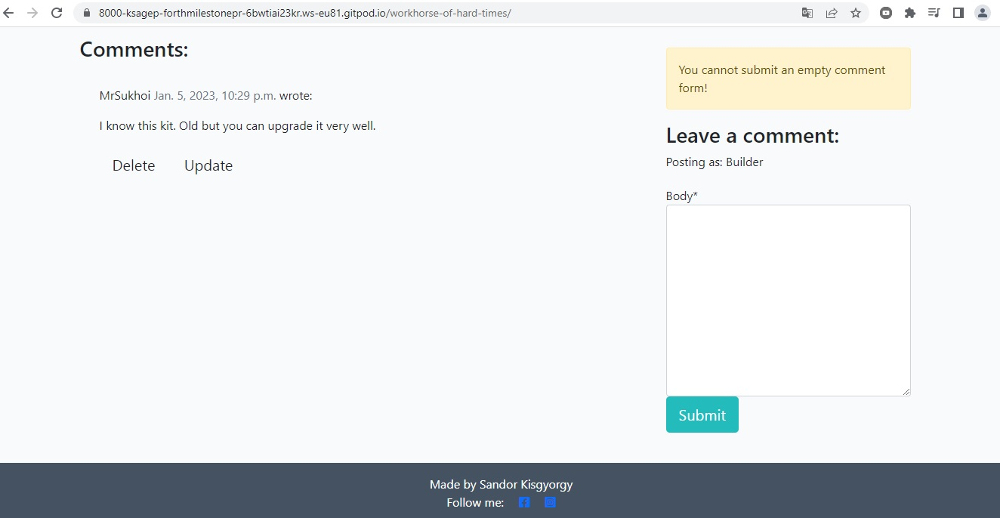

### Structure Plane

The simple structure of blog page is provide a fast and effective usage for users. Furthermore, it provide a lot of possibilities for future development as you could see in the 'Future features' part of README.  

### Skeleton Plane

Design was focused on big screen (desktop, laptop) primarily but you can use this website on mobile also. On bigger screen you find more details in the pictures and easy to follow the text. It was the reason why I chose big screen approach.

### Surface Plane

* Colors

For navigation and footer part of the website the main aim was the big contrast. At the other parts of the blog page the texts and pictures were harmonized with each other so it is not harmful for eyes. 

* Typography

I used one type of font whit two types of thin:

**Lato** (weight: 700, 300)

## Features

### Existing Features

* Created in HTML5, CSS3, Django
* One main page for registration or sign-in and currently two different pages for posts (3 posts by page)
* The users have a possibility to save its username and password for future visits if they put a stick to the 'Remember me' square
* One page for 'Sign out'.

### Features for future implementation

* Grouping of posts according to different scales e.g. 1/72, 1/48, 1/35 etc.
* Grouping of posts according to different type of aircrafts, helicopters, figures, cars, motorcycles etc.
* Upload more than one picture to the post
* Special icons before the username
* Searh between the posts using a keyword
* Create 'Rules of the blog'
* Add 'Like' button and counter to the comments.

### Admin feature

Admin or Superuser has special permission for blog site. She/he/they can sign-in to the blog.

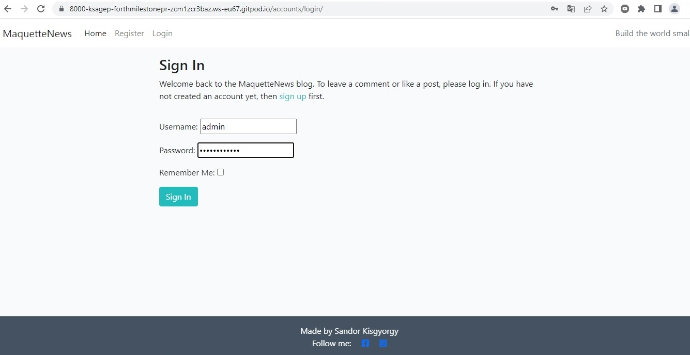

On the front page the admin can manage the email addresses, blogs, comments. Therefore the admin can create and approve group of users or manage single user. On this page we could find the recent activities of admin also. In the menu line the admin could change Her/his/their password or log out about this page.

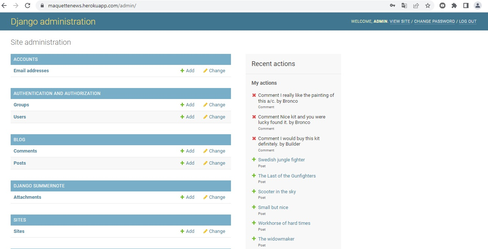

At the authorisation and authentication part the admin could create groups from the registered users or manage them separately. On the attached image you can see that this app has only one person who has admin authorities.

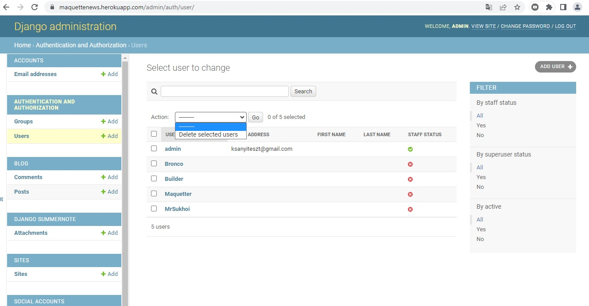

From the blog site perspective the most important part of the admin site is the 'Blog administration'. This part provide possibility for admin to manage the comments from one side. She/he/they could approve or delete comments and in the latter case could prevent the using of unauthorized phrase or make unnecessary tension between the users. Before approval a small, white 'X' in a red circle sign that the comment is non-approved. After approval the sign will change for a white stick in a green circle.

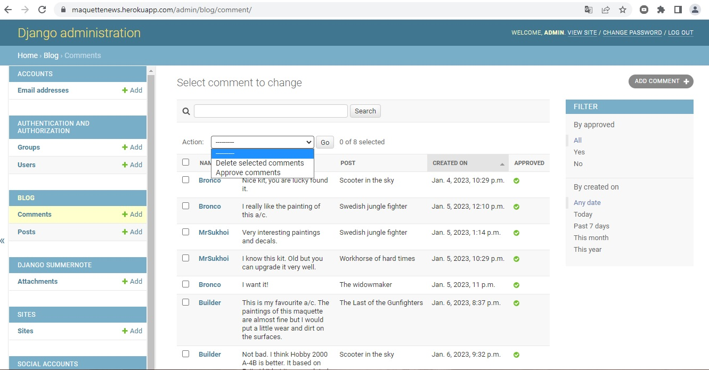

From the other side, this part give a possibility to add or delete posts to the blog. Before the publishing a post, the admin could check it and she/he/they decide that it is fine according to the blog rules or not.

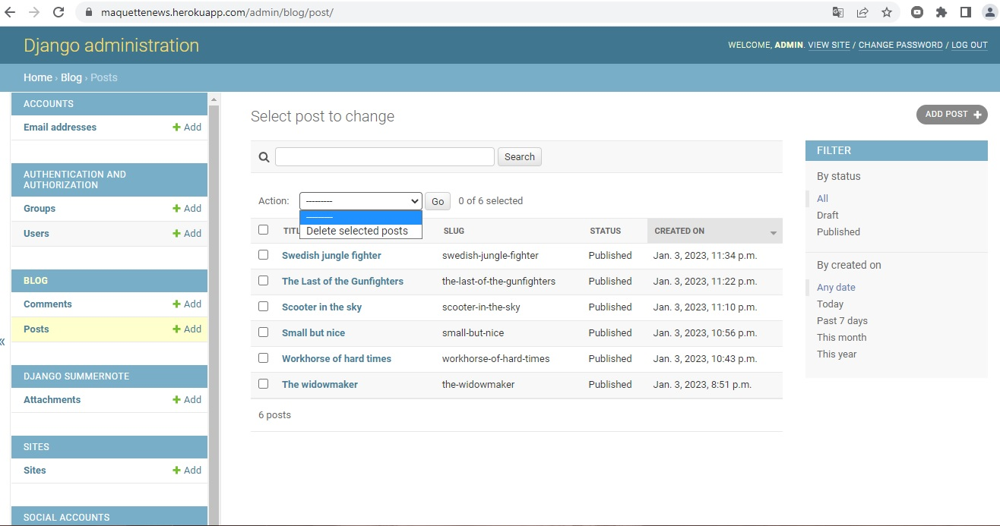

Furthermore, the admin can manage (add, delete, edit) sites, attachments and social accounts (accounts, applications, applications tokens).

When admin finished Her/his/their works leave the page with log out button.

### User feature

If the user wants to use the possibility of comment and like have to register Her-/him-/theirself at first on the register page. Have to create a username and a password but provide the email address is optional. After click on the 'Sign up' button and the registration is finished.

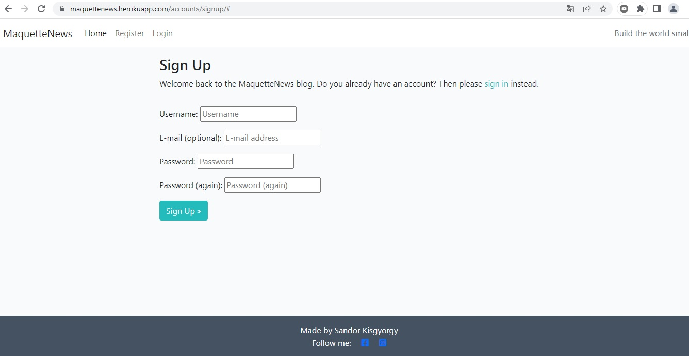

Only the registered user can sign in the blog with username and password. You can find a small 'Remember Me' checkbox under the password which provide the possibility that the system will not forget the password of the user and next time do not have to type the password.

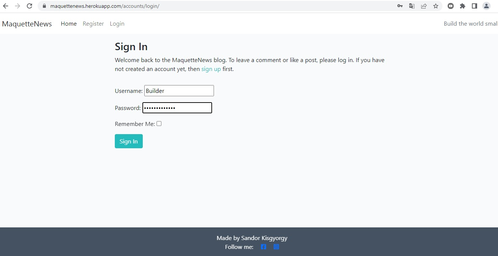

If the username and/or password was/were not correct you will get an error message.

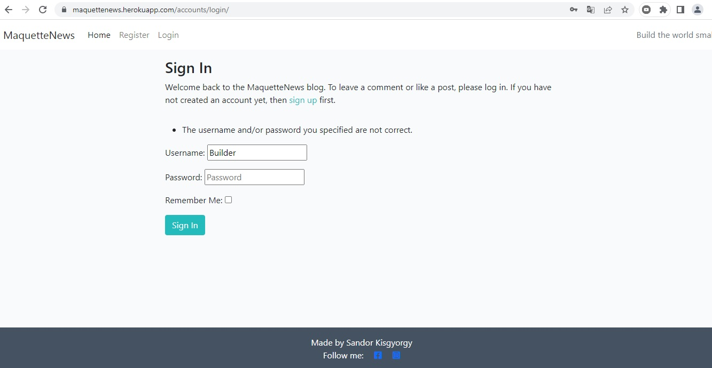

In the case of successful sign-in you can enter the blog and a short message will appear about it for **3 seconds**. After it the user can surf on the pages, add comments or likes to the posts.

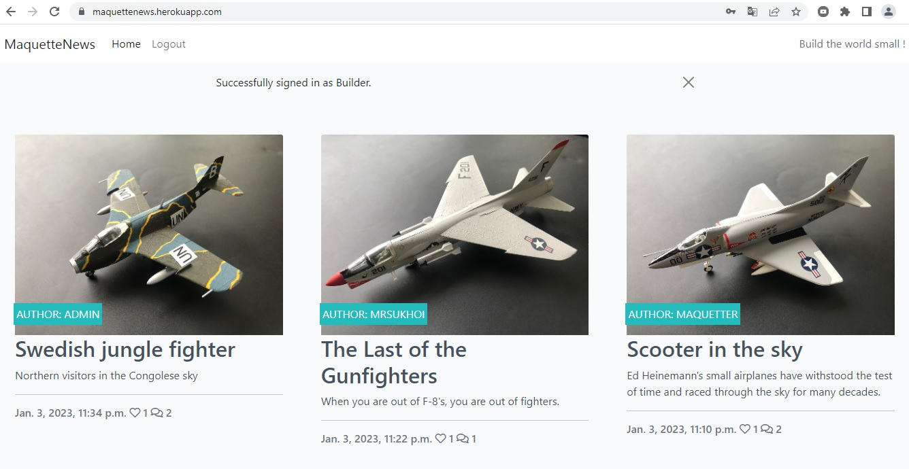

The authenticated users can leave comments for any posts. The length of the comment is no more than 200 charachters.

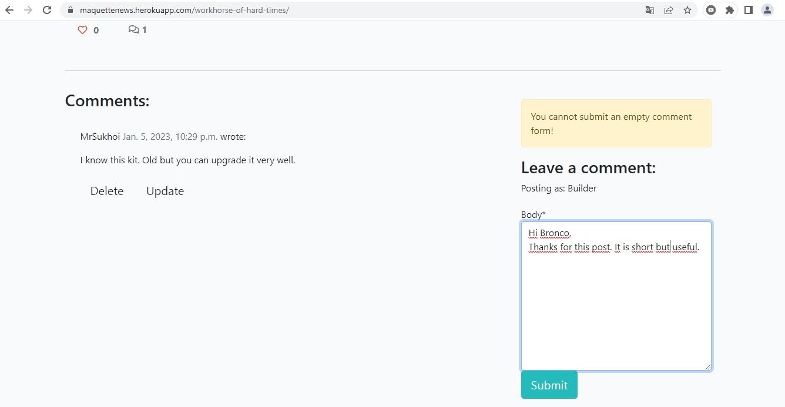

After click on the submit button a short warning message will appear on the screen: 'Your comment is awaiting for approval.'

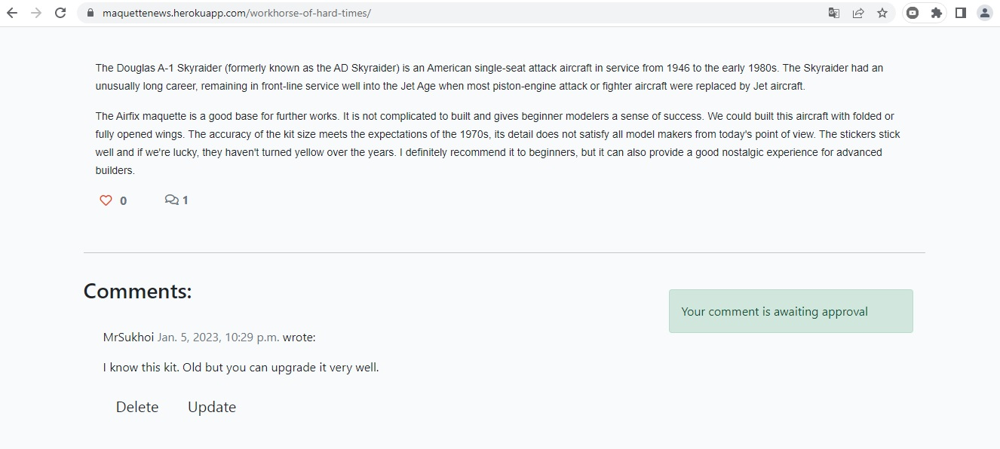

After comment was approved by admin, under the post will appear the new comment and the comment counter will give plus one to the previous amount. The comment contains: the name of user, date of commenting and the content of the comment.

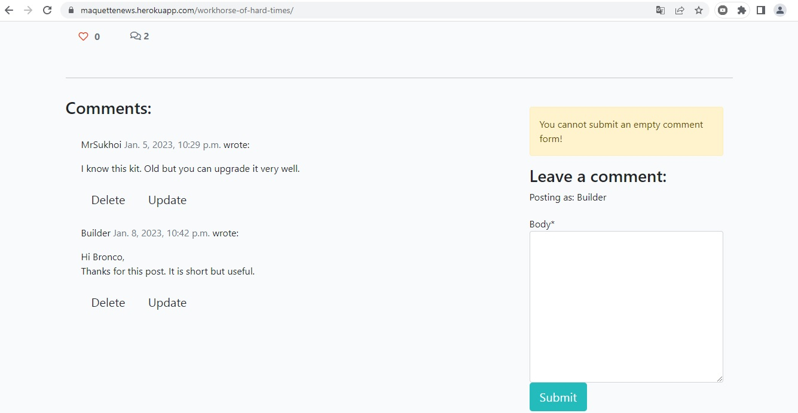

User can comment any post if She/he/they want. Before the click on the 'Like' button you can see on the screen the outline of icon.

After click on the 'Like' button you can see on the screen the filled icon and the like counter will give plus one to the previous amount.

When user finished Her/his/their surfing in the blog leave the page with log out button. On the screen will appear the 'Sign out' button and after click on it She/he/they will leave the page.

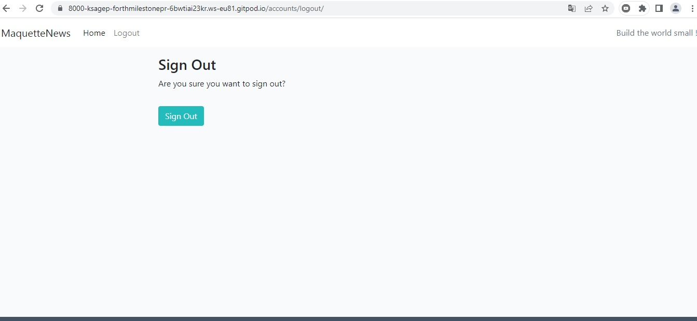

After a successful sign out the system will send a message for 3 seconds.

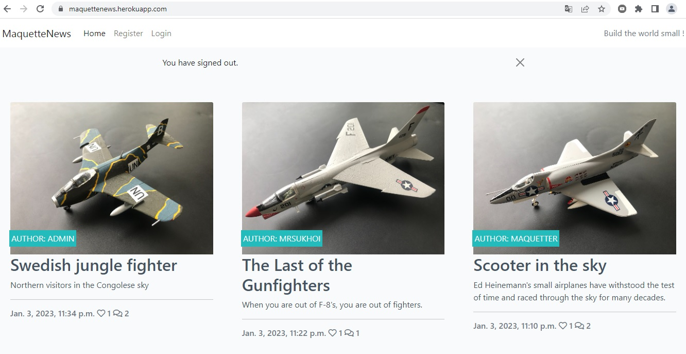

## Technologies

- HTML5 for basic structure of the website
- CSS3 for style the website
- Google Fonts for fonts families
- Font Awesome for social media icons
- Django for the 'working parts' of the page
- Gitpod for version control
- GitHub for storage the files and steps of development of the website

## Resources

- Code Institute course materials
- Code Institute Slack Community for some helps
- Code Institute Mentor meetings and support
- Code Institute tutor support
- Am I Responsive for a responsive image in README 
- I took pictures about my maquettes and used these for posts and I created descriptions and comments for its
- I took the placeholder picture from timeouttoys.co.za webpage
- Youtube/Tech with Tim - some idea
- StackOverflow.com - some thoughts
- w3school.com - some thoughts
- geeksforgeeks.com - some idea
- djangocentral.com - some thoughts

## Defenders of the blog site

This blog has many useful parts which are help the users in one side but in the otherside are protect the page from damage or duplications or unauthorized step etc. You can see below some examples of defenders:

- somebody already registered with this email (the system save the email address if the user give the email address at the registration and compares with those stored in the database):
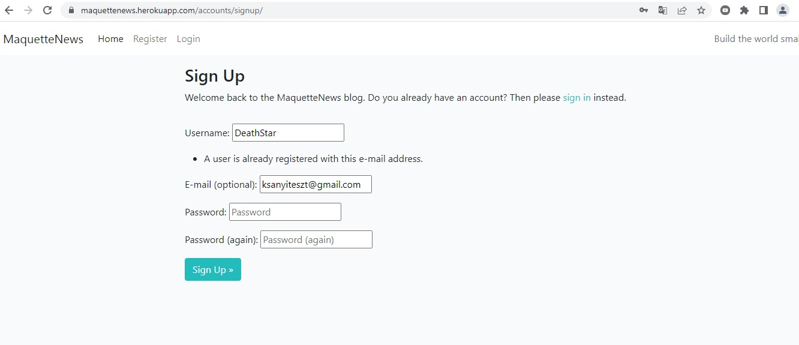

- same password (at the registration have to type two times the same password without any mistake):
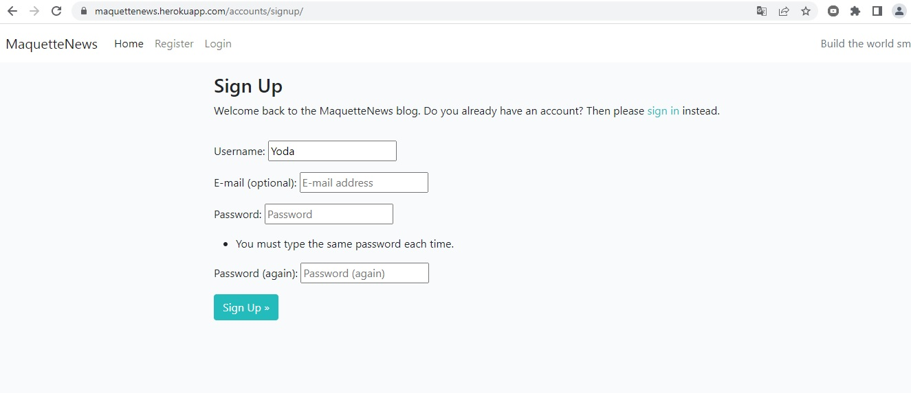

- try to use admin site without permission (the users have not permission to use the admin site):
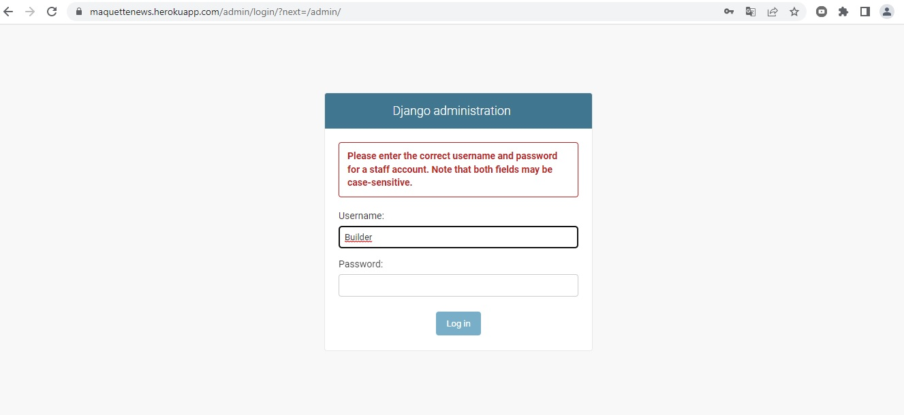

## Bugs and unsolved challenges

I created 'Delete' and 'Update' buttons under each comment but I could not link these buttons to the comments.

## Testing

### Browser testing

Website was tested in Google Chrome, Opera, Microsoft Edge and Safari. On each browser this website works properly (functionality, visuality).

It was tested on  Google Developper Tools and the website worked on these type of devices.

### Validation with pythonchecker.com

I validated every py file of my app with pythonchecker.com validator because the pep8online.com expired and it is not working anymore as a validator. The most common error was that I did not put space around the operators. After the managing errors everything was all right according to the validator.

### Local testing

The buttons of the app were tested locally and these worked properly.

### Responsiveness

I used Google Chrome Dev Tools for this exercise. I tested for mobile and desktop devices. According to the tool, some images were big for mobile devices and the downloads were slow. It is the reason for lower result. 

Lighthouse mobile assessment:
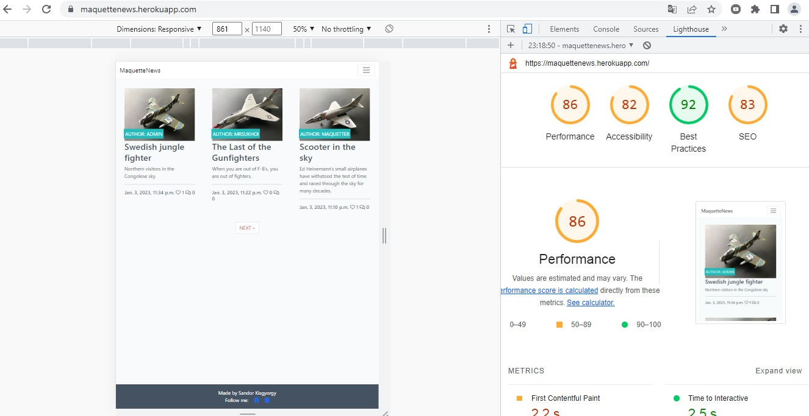

Lighthouse desktop assessment:
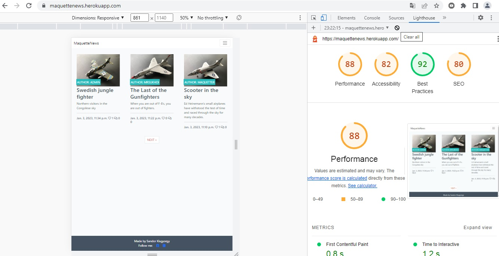

## Version control

I used two repositories during the development: GitPod for local repository and GitHub for remote or background repository. 

I managed the versions with the following process:
- I created a repository in GitHub
- I created User Stories in GitHub
- I opened and developped the repository in GitPod and use during the development the different parts of User Stories
- I used three parts of User Stories:Todo, In Progress and Done

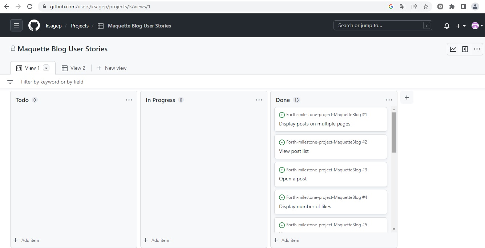

- I created and developped varied files and folders in GitPod
- I put the issues in the relevant part according to the phase of development (start in Todo and put the In Progress while I worked on it and put the Done if I finished the development)
- I saved and pushed my works to GitHub repository after every important step of development:
    1. git add . - adding work to git
    2. git commit -m "Commit message" - to commit the stage of work
    3. git push - to update my work in GitHub

## Publish the project

The steps of the publishing on the Heroku were as follow:
    
    1. I created an app name and set the location (Europe)
    2. In the **"Settings"** I managed the config vars part
    3. In the buildpacks I chose heroku/python
    4. In the Deploy section I create a connection between GitHub and Heroku
    5. With the Deploy Branch button I created a deployed app
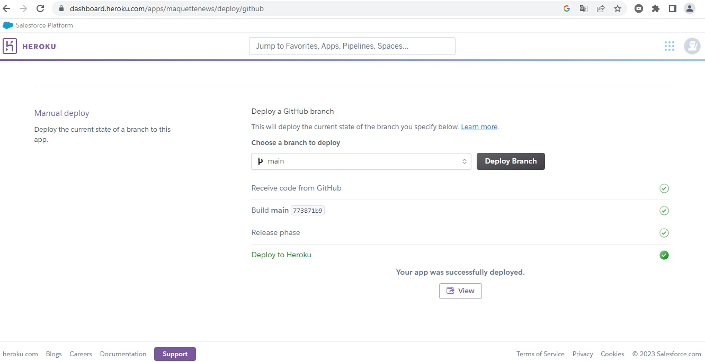
    6. The website was published on Heroku Page and the link was provided in the same section.