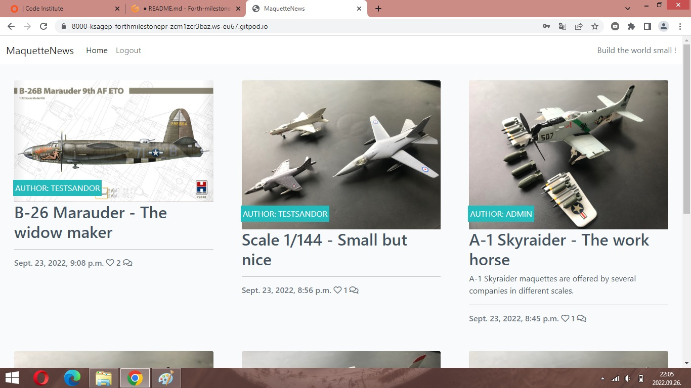
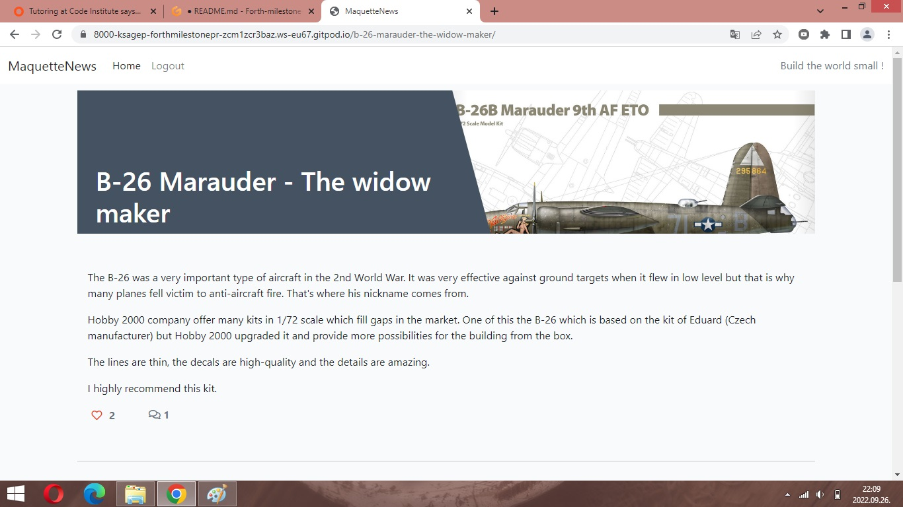

# MaquetteNews Blog for modelers

I took the advice of my mentor and the teachers of the Code Institute's Diploma in Software Development Course and I have created a blog site which I liked and enjoyed the development of it. This blog page was inspired mainly by Code Institute: 'I think, therefore I blog' lessons.

For link to this website click [Here](https://ksagep.github.io/).

Design has been focused to *Desktop, Laptop and Tablet first* and *Responsive* but it is also working on mobile assets.


## Who is this blog site for?

This blog pages contains information about maquettes which are mainly aircrafts. These information would be interesting who makes maquette or who wants a little bit more info about a specific model.

## What does this website do?

The website serves as a collection of pictures and short descriptions of different maquettes. The registered users could take posts, like or comment any posts. Possibility of comment could provide a base for small conversation between users. The non-registered users can see the posts but they can not take a post, like or comment the posts.

## UX 5 Planes

### Strategy Plane

This page was created in a simple way or tried to follow it. The information, picture are clear and serves to help the visitors of the website. The posts are following the same structure and containing the same icons.

### Scope Plane

In this project you can find the following features:
* The header and footer are common in every pages (before login and after it)
* Two different pages which are as follows:

- Home page contains six posts and pictures and the possibilities of register of login. The step of visitor is depend that she/he visits the blog as registered user or not.


- Home page header changes after login and the possibility of register will disappear.



- The post view contains a pictures of maquette or a box art as well as a short description of it. Under this part the registered users could like the post or comment it.



### Structure Plane

The simple structure of blog page is provide a fast and effective usage for users. Furthermore, it provide a lot of possibilities for future development as you could see in the future features part of README.  

### Skeleton Plane

Design was focused on big screen (desktop, laptop) primarily but you can use this website on mobile also. On bigger screen you find more details in the pictures and easy to follow the text. It was the reason why I chose big screen approach.

### Surface Plane

* Colors

For navigation and footer part of the website the main aim was the big contrast. At the other parts of the blog page the texts and pictures were harmonized with each other so it is not harmful for eyes. 

* Typography

I used one type of font whit two types of thin:

**Lato** (weight: 700, 300)

## Features

### Existing Features

* Created in HTML5, CSS3, Django
* One main page for registration or sign-in and currently two different pages for posts (6 posts by page)
* The users have a possibility to save its username and password for future visits if they put a stick to the 'Remember me' square
* One page for 'Sign out'.

### Features for future implementation

* Grouping of posts according to different scales e.g. 1/72, 1/48, 1/35 etc.
* Upload more than one picture to the post
* Special icons before the username
* Searh between the posts using a keyword

### Admin feature

Admin or Superuser has special permission for blog site. She/he/they can sign-in to the blog


or use a special page which is under 'Django administration / Site administration'.


On this site admin can manage the email addresses, delete or veify these. Before verification, next to the email address you can find a red cross marker which will change to a white stick in green base after verification.


At the authorisation and authentication part the admin could create groups from the registered users or manage them separately.


From the blog site perspective the most important part of the admin site is the 'Blog administration'. This part provide possibility for admin to manage the comments from one side. She/he/they could approve or delete comments and in the latter case could prevent the using of unauthorized phrase or make unnecessary tension between the users.


From the other side, this part give a possibility to add or delete posts to the blog. Before the publishing a post, the admin could check it and she/he/they decide that it is fine according to the blog rules or not.


Furthermore, the admin can manage (add, delete, edit) sites, attachments and social accounts (accounts, applications, applications tokens). 

## Technologies

- HTML5 for basic structure of the website
- CSS3 for style the website
- Google Fonts for fonts families
- Font Awesome for social media icons
- Django for the 'working parts' of the page
- Git for version control
- GitHub for storage the files and steps of development of the website

## Resources

- Code Institute course materials
- Code Institute Slack Community for some helps
- Code Institute Mentor meetings and support
- Code Institute tutor support
- Am I Responsive for a responsive image in README 
- I took pctures about my maquettes and used these for posts

## Defenders of the blog site
This blog has many useful parts which are help the users in one side but in the otherside are protect the page from damage or duplications or unauthorized step etc. You can see below some examples of defenders:

- somebody already registered with this email (the system save the email address if the user give the email address at the registration and compares with those stored in the database):


- same password (at the registration have to type two times the same password without any mistake):


- try to use admin site without permission (the users have not permission to use the admin site):


- try to register without fill the necessary fields:


## Testing

### Browser testing

Website was tested in Google Chrome, Opera, Microsoft Edge and Safari. On each browser this website works properly (functionality, visuality).

It was tested on  Macbook Pro, Apple iPhone 13 Pro and Samsung A6 and A10 mobile phones and the website worked on these type of devices.

### Validators

The website was checked by W3C HTML validator and it did not reported any issues. You can find the result [Here](assets/images/W3C%20HTML%20assessment.jpg).

The website was checked by W3C CSS validator and it did not reported any issues. You can find the result [Here](assets/images/W3C%20CSS%20assessment.jpg).

### Local testing

The buttons of the website were tested locally and these worked properly.

### Responsiveness

I used Google Chrome Dev Tools for this exercise. I tested for mobile and desktop devices. According to the tool, some images were big for mobile devices and the downloads were slow.

Lighthouse mobile assessment:


Lighthouse desktop assessment:


## Version control

I used two repositories during the development: GitPod for local repository and GitHub for remote or background repository. 

I managed the versions with the following process:
- I created a repository in GitHub
- I opened and developped the repository in GitPod
- I created and developped varied files and folders in GitPod
- I saved and pushed my works to GitHub repository:
    1. git add . - adding work to git
    2. git commit -m "Commit message" - to commit the stage of work
    3. git push - to update my work in GitHub

## Publish the project

The steps of the publishing on the GitHub were as follow:
    
    1. **"Settings"** on the repository
    2. **"Source"** of "GitHub Pages" selected *master for Branch* and saved it
    3. The website was published on GitHub Pages and the link was provided in the same section.


Welcome ksagep,

This is the Code Institute student template for Gitpod. We have preinstalled all of the tools you need to get started. It's perfectly ok to use this template as the basis for your project submissions.

You can safely delete this README.md file, or change it for your own project. Please do read it at least once, though! It contains some important information about Gitpod and the extensions we use. Some of this information has been updated since the video content was created. The last update to this file was: **September 1, 2021**

## Gitpod Reminders

To run a frontend (HTML, CSS, Javascript only) application in Gitpod, in the terminal, type:

`python3 -m http.server`

A blue button should appear to click: _Make Public_,

Another blue button should appear to click: _Open Browser_.

To run a backend Python file, type `python3 app.py`, if your Python file is named `app.py` of course.

A blue button should appear to click: _Make Public_,

Another blue button should appear to click: _Open Browser_.

In Gitpod you have superuser security privileges by default. Therefore you do not need to use the `sudo` (superuser do) command in the bash terminal in any of the lessons.

To log into the Heroku toolbelt CLI:

1. Log in to your Heroku account and go to *Account Settings* in the menu under your avatar.
2. Scroll down to the *API Key* and click *Reveal*
3. Copy the key
4. In Gitpod, from the terminal, run `heroku_config`
5. Paste in your API key when asked

You can now use the `heroku` CLI program - try running `heroku apps` to confirm it works. This API key is unique and private to you so do not share it. If you accidentally make it public then you can create a new one with _Regenerate API Key_.

## FAQ about the uptime script

**Why have you added this script?**

It will help us to calculate how many running workspaces there are at any one time, which greatly helps us with cost and capacity planning. It will help us decide on the future direction of our cloud-based IDE strategy.

**How will this affect me?**

For everyday usage of Gitpod, it doesn’t have any effect at all. The script only captures the following data:

- An ID that is randomly generated each time the workspace is started.
- The current date and time
- The workspace status of “started” or “running”, which is sent every 5 minutes.

It is not possible for us or anyone else to trace the random ID back to an individual, and no personal data is being captured. It will not slow down the workspace or affect your work.

**So….?**

We want to tell you this so that we are being completely transparent about the data we collect and what we do with it.

**Can I opt out?**

Yes, you can. Since no personally identifiable information is being captured, we'd appreciate it if you let the script run; however if you are unhappy with the idea, simply run the following commands from the terminal window after creating the workspace, and this will remove the uptime script:

```
pkill uptime.sh
rm .vscode/uptime.sh
```

**Anything more?**

Yes! We'd strongly encourage you to look at the source code of the `uptime.sh` file so that you know what it's doing. As future software developers, it will be great practice to see how these shell scripts work.
